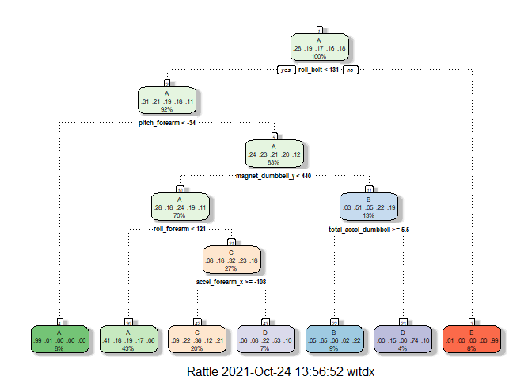
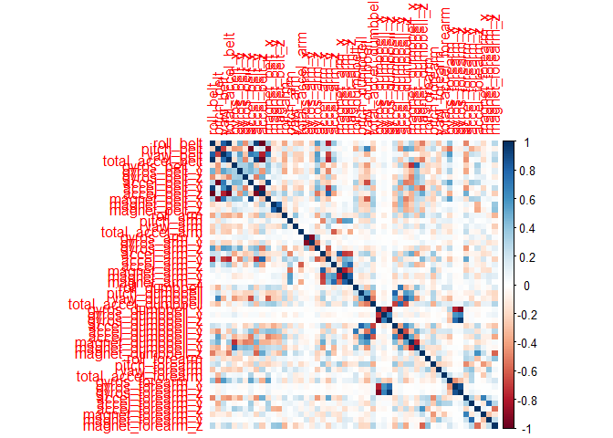
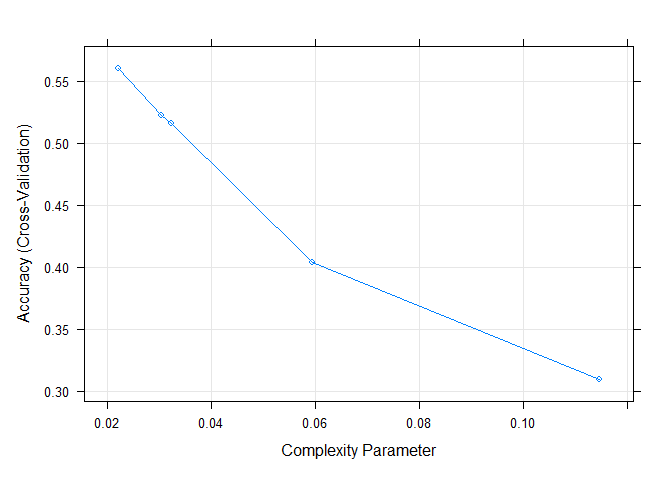
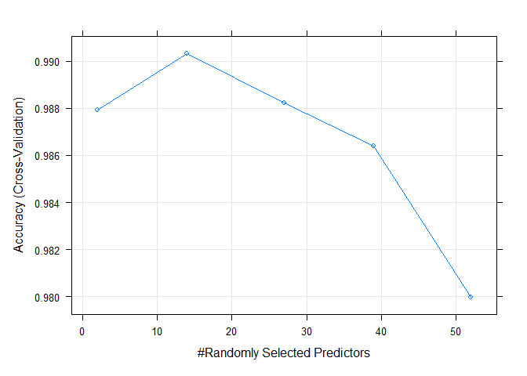
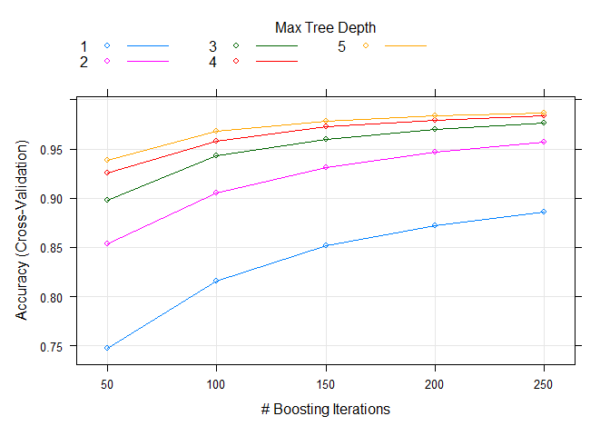

## Introduction

Using devices such as Jawbone Up, Nike FuelBand, and Fitbit it is now
possible to collect a large amount of data about personal activity
relatively inexpensively. These type of devices are part of the
quantified self movement – a group of enthusiasts who take measurements
about themselves regularly to improve their health, to find patterns in
their behavior, or because they are tech geeks. One thing that people
regularly do is quantify how much of a particular activity they do, but
they rarely quantify how well they do it.

## Aim

### Use data from accelerometers on the belt, forearm, arm, and dumbbell of 6 participants and quantify how much work they do.

## Preprocessing the data

    # Load the required libraries
    library(ggplot2)
    library(lattice)
    library(caret)
    library(kernlab)

    ## 
    ## Attaching package: 'kernlab'

    ## The following object is masked from 'package:ggplot2':
    ## 
    ##     alpha

    library(rattle)

    ## Loading required package: tibble

    ## Loading required package: bitops

    ## Rattle: A free graphical interface for data science with R.
    ## Version 5.4.0 Copyright (c) 2006-2020 Togaware Pty Ltd.
    ## Type 'rattle()' to shake, rattle, and roll your data.

    library(corrplot)

    ## corrplot 0.90 loaded

    set.seed(12)  #for reproducibility

## Loading the data

The two training and testing csv files can be directly downloaded from
the source and then read into data frames.

    train_csv <- read.csv("./pml-training.csv")
    test_csv  <- read.csv("./pml-testing.csv")
    dim(train_csv)

    ## [1] 19622   160

    dim(test_csv)

    ## [1]  20 160

As can be seen above :  
1. Training data has dimensions 19622 X 160.  
2. Testing data has dimensions 20 X 160.  
3. The first dimension is the number of observations.

## Cleaning the data

We can start with removing the NA variables.

    # Initially we remove the NA columns
    train_csv <- train_csv[,colMeans(is.na(train_csv))< .9]
    # Also on observing the head of the data it is seen that, the
    # first seven cols are just metadata and hence are irrelevant
    # to any outcome
    train_csv <- train_csv[,-c(1:7)]

A zero variance indicates that all values within the set of a numbers
are identical. Hence we can safely remove these values.

    nvz_check <- nearZeroVar(train_csv)
    train_csv <- train_csv[,-nvz_check]
    dim(train_csv)

    ## [1] 19622    53

Now we can perform a standard split of the data-set into training and
validation sets. We’ll use training set for training our models and the
validation set of testing purposes.

    factor <- createDataPartition(y=train_csv$classe,p=0.7,list=F)
    train_data <- train_csv[factor,]
    valid_data <- train_csv[-factor,]

# Creating and Testing the Models

    # trainControl command controls the computational nuances of the
    # train function.We use the cross validation method here and set
    # the number of iterations to 3 and don't print the training log
    control <- trainControl(method="cv", number=3, verboseIter=F)

## Methodology

### We use the train function which sets up a grid of tuning parameters for a number of classification and regression routines, fits each model and calculates a resampling based performance measure.

### We also use the prefict function which predicts the values based on the input data.

## Decision Tree

Code for the Model:

    model_trees <- train(classe~., data=train_data, method="rpart", trControl = control, tuneLength = 5)
    fancyRpartPlot(model_trees$finalModel)

 Code for the
Prediction:

    pred_trees <- predict(model_trees, valid_data)
    matrix_trees <- confusionMatrix(pred_trees, factor(valid_data$classe))
    matrix_trees

    ## Confusion Matrix and Statistics
    ## 
    ##           Reference
    ## Prediction    A    B    C    D    E
    ##          A 1531  471  464  429  161
    ##          B   18  332   24    8  124
    ##          C   93  256  417  116  230
    ##          D   31   80  121  411   76
    ##          E    1    0    0    0  491
    ## 
    ## Overall Statistics
    ##                                           
    ##                Accuracy : 0.5407          
    ##                  95% CI : (0.5279, 0.5535)
    ##     No Information Rate : 0.2845          
    ##     P-Value [Acc > NIR] : < 2.2e-16       
    ##                                           
    ##                   Kappa : 0.4014          
    ##                                           
    ##  Mcnemar's Test P-Value : < 2.2e-16       
    ## 
    ## Statistics by Class:
    ## 
    ##                      Class: A Class: B Class: C Class: D Class: E
    ## Sensitivity            0.9146  0.29148  0.40643  0.42635  0.45379
    ## Specificity            0.6379  0.96334  0.85697  0.93741  0.99979
    ## Pos Pred Value         0.5010  0.65613  0.37500  0.57163  0.99797
    ## Neg Pred Value         0.9495  0.84997  0.87241  0.89295  0.89041
    ## Prevalence             0.2845  0.19354  0.17434  0.16381  0.18386
    ## Detection Rate         0.2602  0.05641  0.07086  0.06984  0.08343
    ## Detection Prevalence   0.5193  0.08598  0.18895  0.12218  0.08360
    ## Balanced Accuracy      0.7762  0.62741  0.63170  0.68188  0.72679

## Random Forest Classifier

    rf_model <- train(classe~., data=train_data, method="rf", trControl = control, tuneLength = 5)
    rf_prediction <- predict(rf_model, valid_data)
    matrix_rf <- confusionMatrix(rf_prediction, factor(valid_data$classe))
    matrix_rf

    ## Confusion Matrix and Statistics
    ## 
    ##           Reference
    ## Prediction    A    B    C    D    E
    ##          A 1672    5    0    0    0
    ##          B    2 1131    5    0    0
    ##          C    0    3 1019    7    0
    ##          D    0    0    2  956    1
    ##          E    0    0    0    1 1081
    ## 
    ## Overall Statistics
    ##                                           
    ##                Accuracy : 0.9956          
    ##                  95% CI : (0.9935, 0.9971)
    ##     No Information Rate : 0.2845          
    ##     P-Value [Acc > NIR] : < 2.2e-16       
    ##                                           
    ##                   Kappa : 0.9944          
    ##                                           
    ##  Mcnemar's Test P-Value : NA              
    ## 
    ## Statistics by Class:
    ## 
    ##                      Class: A Class: B Class: C Class: D Class: E
    ## Sensitivity            0.9988   0.9930   0.9932   0.9917   0.9991
    ## Specificity            0.9988   0.9985   0.9979   0.9994   0.9998
    ## Pos Pred Value         0.9970   0.9938   0.9903   0.9969   0.9991
    ## Neg Pred Value         0.9995   0.9983   0.9986   0.9984   0.9998
    ## Prevalence             0.2845   0.1935   0.1743   0.1638   0.1839
    ## Detection Rate         0.2841   0.1922   0.1732   0.1624   0.1837
    ## Detection Prevalence   0.2850   0.1934   0.1749   0.1630   0.1839
    ## Balanced Accuracy      0.9988   0.9958   0.9956   0.9955   0.9994

## Gradient Boosted Trees Classifier

    gbt_model <- train(classe~., data=train_data, method="gbm", trControl = control, tuneLength = 5, verbose = F)
    gbt_prediction <- predict(gbt_model, valid_data)
    matrix_gbt <- confusionMatrix(gbt_prediction, factor(valid_data$classe))
    matrix_gbt

    ## Confusion Matrix and Statistics
    ## 
    ##           Reference
    ## Prediction    A    B    C    D    E
    ##          A 1664    5    0    0    0
    ##          B    8 1122   10    0    1
    ##          C    1   12 1008    8    2
    ##          D    1    0    7  955    6
    ##          E    0    0    1    1 1073
    ## 
    ## Overall Statistics
    ##                                           
    ##                Accuracy : 0.9893          
    ##                  95% CI : (0.9863, 0.9918)
    ##     No Information Rate : 0.2845          
    ##     P-Value [Acc > NIR] : < 2.2e-16       
    ##                                           
    ##                   Kappa : 0.9865          
    ##                                           
    ##  Mcnemar's Test P-Value : NA              
    ## 
    ## Statistics by Class:
    ## 
    ##                      Class: A Class: B Class: C Class: D Class: E
    ## Sensitivity            0.9940   0.9851   0.9825   0.9907   0.9917
    ## Specificity            0.9988   0.9960   0.9953   0.9972   0.9996
    ## Pos Pred Value         0.9970   0.9833   0.9777   0.9856   0.9981
    ## Neg Pred Value         0.9976   0.9964   0.9963   0.9982   0.9981
    ## Prevalence             0.2845   0.1935   0.1743   0.1638   0.1839
    ## Detection Rate         0.2828   0.1907   0.1713   0.1623   0.1823
    ## Detection Prevalence   0.2836   0.1939   0.1752   0.1647   0.1827
    ## Balanced Accuracy      0.9964   0.9905   0.9889   0.9939   0.9956

## Support Vector Machine Classifier

    svm_model <- train(classe~., data=train_data, method="svmLinear", trControl = control, tuneLength = 5, verbose = F)
    svm_prediction <- predict(svm_model, valid_data)
    matrix_svm <- confusionMatrix(svm_prediction, factor(valid_data$classe))
    matrix_svm

    ## Confusion Matrix and Statistics
    ## 
    ##           Reference
    ## Prediction    A    B    C    D    E
    ##          A 1552  143   87   66   48
    ##          B   29  808   90   33  139
    ##          C   48   72  804  106   84
    ##          D   39   30   21  724   64
    ##          E    6   86   24   35  747
    ## 
    ## Overall Statistics
    ##                                          
    ##                Accuracy : 0.7876         
    ##                  95% CI : (0.7769, 0.798)
    ##     No Information Rate : 0.2845         
    ##     P-Value [Acc > NIR] : < 2.2e-16      
    ##                                          
    ##                   Kappa : 0.73           
    ##                                          
    ##  Mcnemar's Test P-Value : < 2.2e-16      
    ## 
    ## Statistics by Class:
    ## 
    ##                      Class: A Class: B Class: C Class: D Class: E
    ## Sensitivity            0.9271   0.7094   0.7836   0.7510   0.6904
    ## Specificity            0.9183   0.9387   0.9362   0.9687   0.9686
    ## Pos Pred Value         0.8186   0.7352   0.7217   0.8246   0.8318
    ## Neg Pred Value         0.9694   0.9308   0.9535   0.9521   0.9328
    ## Prevalence             0.2845   0.1935   0.1743   0.1638   0.1839
    ## Detection Rate         0.2637   0.1373   0.1366   0.1230   0.1269
    ## Detection Prevalence   0.3222   0.1867   0.1893   0.1492   0.1526
    ## Balanced Accuracy      0.9227   0.8240   0.8599   0.8599   0.8295

## Prediction using the Test Dataset

### We use the random forest classifier here because it provides a **higher accuracy**

through cross validation and handles the missing values and maintains
the accuracy of a large proportion of data.

    final <- predict(rf_model,test_csv)
    print(final)

    ##  [1] B A B A A E D B A A B C B A E E A B B B
    ## Levels: A B C D E

## Appendix : Figures

### 1.Correlation Matrix of Training Set Variables

    corr <- cor(train_data[, -length(names(train_data))])
    corrplot(corr, method="color")

 \#\#\# 2.Plotting
the models

**Decision Tree**

    plot(model_trees)

**Random Forest**

    plot(rf_model)

**Gradient Boosted Tree**

    plot(gbt_model)

